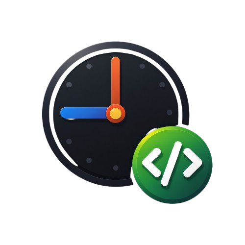

# TraceTime

[p align="center"]
	<a href="https://patrickcaloriocarvalho.github.io/TraceTimeDev/">
		
	</a>
[/p]

TraceTime é um pequeno aplicativo desktop construído com Tauri (Rust) e React + TypeScript (Vite) para controlar sessões de tempo e enviar lançamentos para issues no GitLab.

## Visão rápida

- Frontend: React + TypeScript (Vite)
- Backend nativo: Rust via Tauri (opera chamadas ao GitLab e persistência local)
- UI: `src/App.tsx`, configurações em `src/Config.tsx`

## Documentação online

A documentação pública está disponível em: https://patrickcaloriocarvalho.github.io/TraceTimeDev/

## Executando em desenvolvimento

Instale dependências e execute o modo dev (desktop via Tauri):

```bash
npm install
npm run tauri dev
```


## Estrutura útil

- `src/` — código React + UI
- `src-tauri/` — código Rust e bindings Tauri
- `docs/` — página estática para GitHub Pages (documentação)

## Contribuindo

Abra issues ou envie pull requests com melhorias. Para testes locais, rode o app em dev conforme acima.
